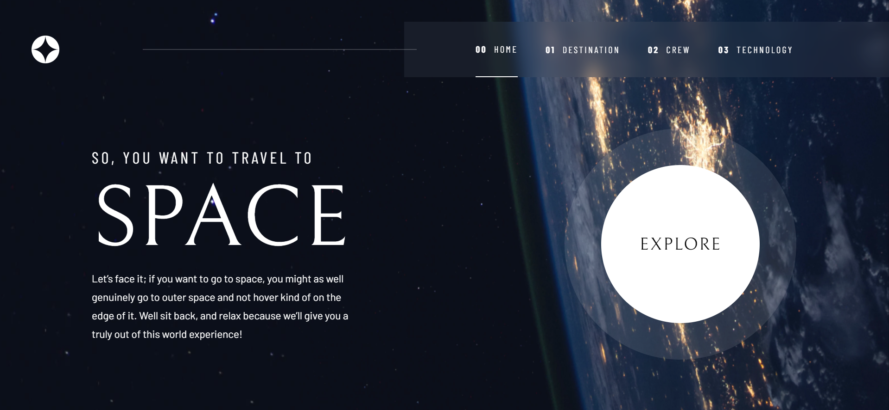
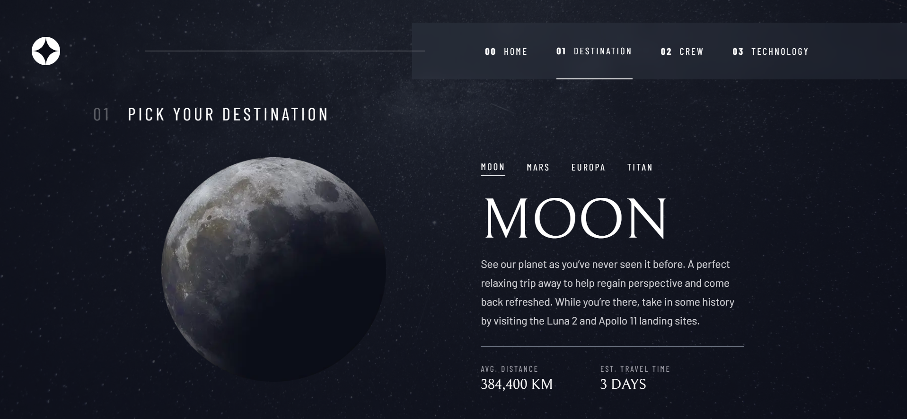
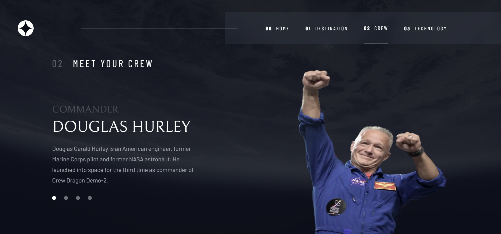
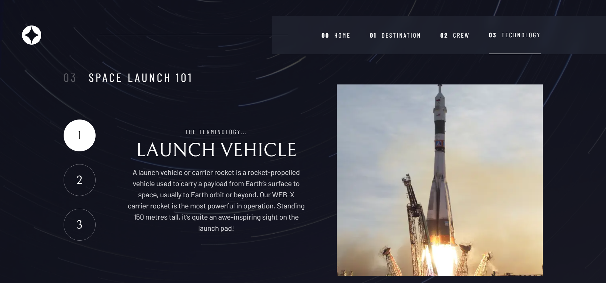
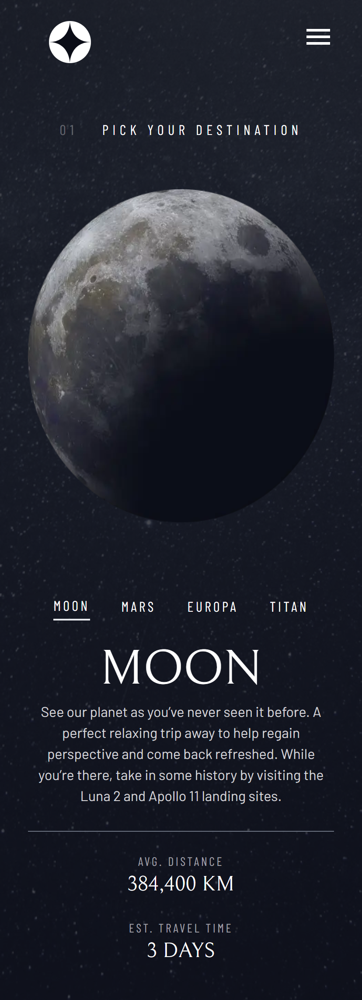
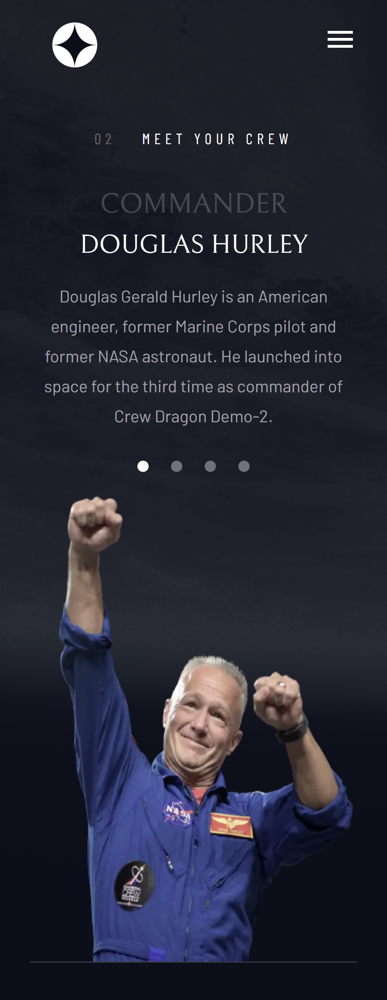
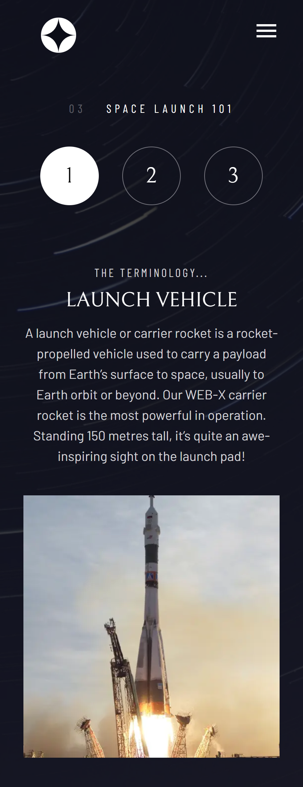

# Space Tourism 🚀🌑

O projeto Space Tourism foi desenvolvido para completar o desafio do Frontend Mentor.

O projeto consiste em um site de múltiplas páginas de turismo espacial, com pequenas funcionalidades para verificar informações de destinos espaciais, informações da equipe por trás do projeto e as tecnologias que eles utilizam. 

## Screenshots

### Screen da página Home

### Screen da página Destination

### Screen da página Crew

### Screen da página Technology

## Screenshots Mobile

### Screen da página Home

### Screen da página Destination

### Screen da página Crew

### Screen da página Technology

[🔗 Clique aqui para acessar](https://space-tourism-cyan-tau.vercel.app/)

## 🛠️ Tecnologias

- React
- Next.js
- JavaScript
- TailwindCSS

## 💙 Contato
Criado por João Oliveira

